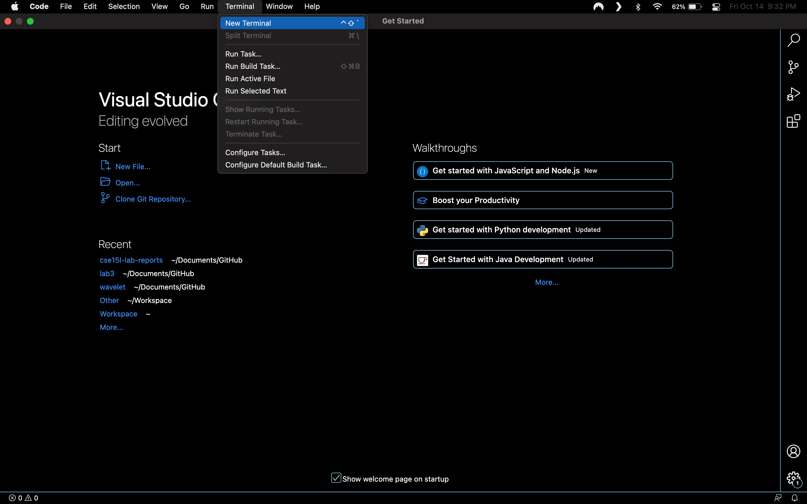
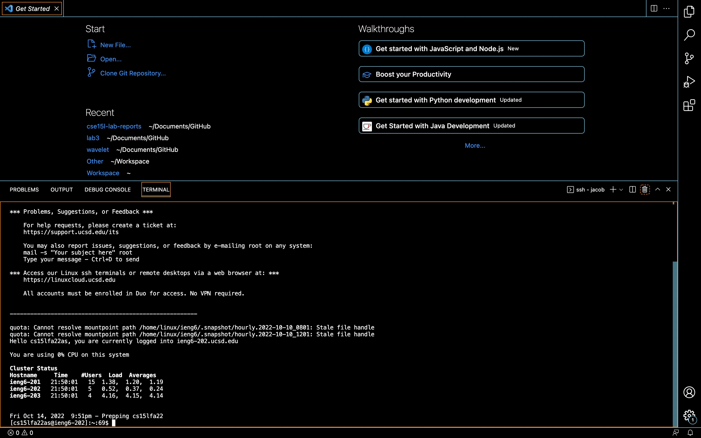
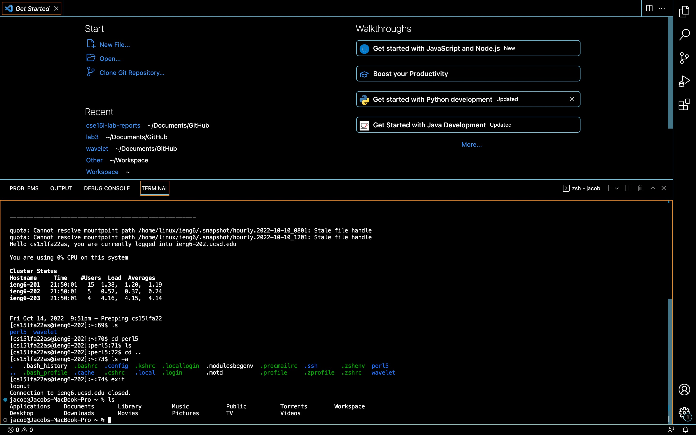
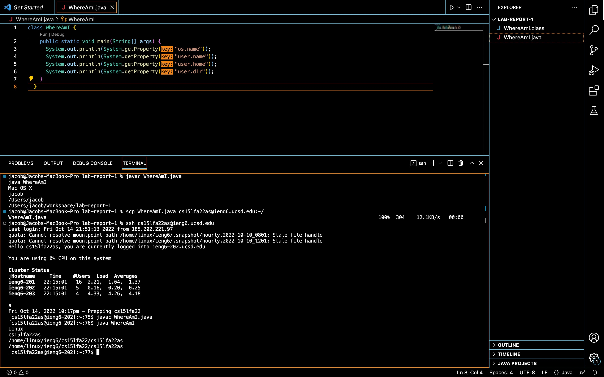
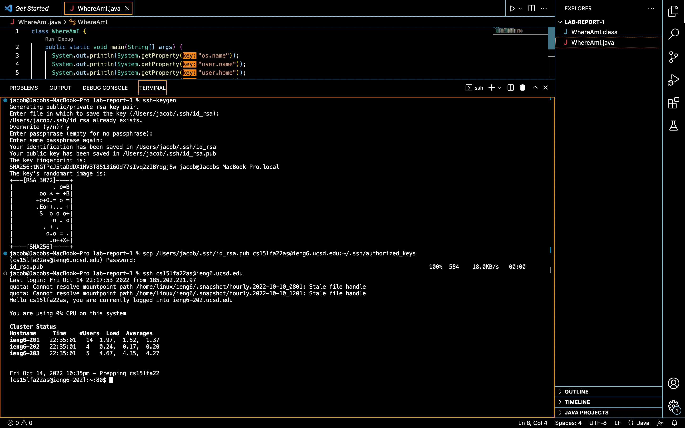
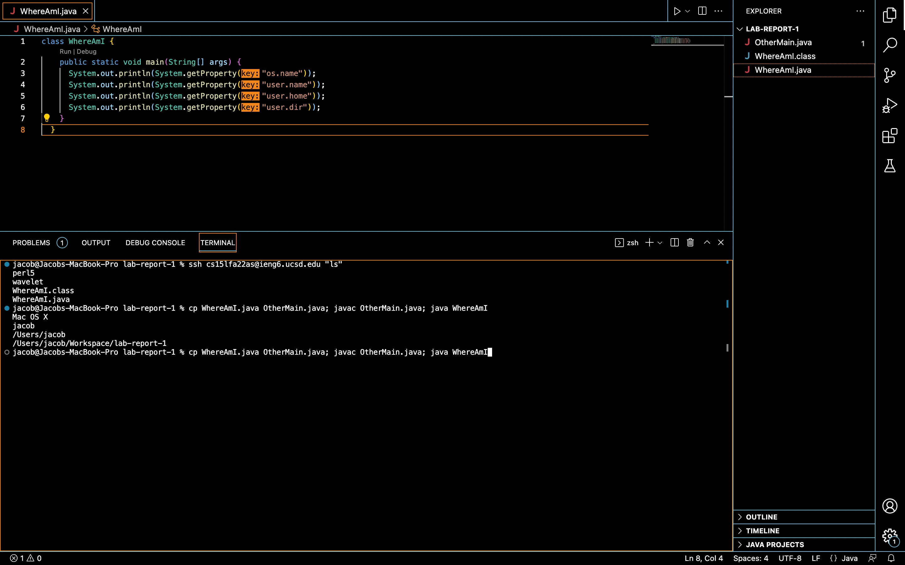

<style>
.markdown-body .highlight pre {background-color: #202020; color: white; border-radius: 8px;}
body {background-color: black; color: #f0f0f0;}
img[alt=image] {width: max(50vw, 50vh);}
.highlight {background-color: black;}
</style>

# Week 1 Lab Report

## Installing VScode
1. Install [VScode](https://code.visualstudio.com/Download) for your OS.
2. On mac, extract the .dmg from the .zip file then drag the .dmg into your applications folder. On windows, follow the prompts for installation. Open VScode.
3. Now that VScode is intsalled and opened, let's try to open a terminal! Use the **ctrl+`** shortcut on mac or navigate to the button illustrated in the following screenshot:


## Remotely Connecting
1. Now that we have a terminal open, let's try remotely connecting to UCSD's CSE 15L server. On windows, you must first install [OpenSSH](https://learn.microsoft.com/en-us/windows-server/administration/openssh/openssh_install_firstuse?tabs=gui#install-openssh-for-windows). On mac, you may proceed.
2. Enter the command `ssh cs15lfa22zz@ieng6.ucsd.edu` but replace the *zz* portion with the two letters linked to your account.
3. You *do* want to continue connecting so enter `yes`.
4. Now enter your password. **Warning:** your password will not show up as letters nor little circles. You'll have several attempts, but it may be easier to type out your password elsewhere then copy/paste it into the terminal.
5. Once your in, you should see something like this:


## Trying Some Commands
1. *"I'm in."* Let's try some commands. A very useful command is `ls` that shows you the directories in your current directory. Try it.
2. To change directories use the command `cd` followed by the name of the directory you want to change to. If you partially type the directory name then hit **tab** it will autocomplete... unless the partial name isn't unique. That is the computer has two or more directories to autocomplete to (e.g. you type **per** and there are two directories **perl5** and **personal-fan-fiction-no-one-should-read**). Try using the command! For me `cd perl5` will take me into that directory.
3. How do we go back a directory? Use `cd ..`.
4. This is kind of boring, let's try some options! Options are given after a command and specify parameters the command should follow. For instance, the `ls` command only shows directories, but if you also want to see files, try `ls -a`. The `-a` option stands for all.
5. Now try the command `exit` which will take you back to your client machine... the local machine you're working from. Now try an `ls` command on that!



## Moving Files with scp
1. Now that we're back on our client machine, let's try securely copying a file to our remote server. We can achieve this using the `scp` command.
2. First we have to create a file. Create a file called **WhereAmI.java** using the following code:
```
class WhereAmI {
  public static void main(String[] args) {
    System.out.println(System.getProperty("os.name"));
    System.out.println(System.getProperty("user.name"));
    System.out.println(System.getProperty("user.home"));
    System.out.println(System.getProperty("user.dir"));
  }
}
```
3. Run that file on your client machine using the following commands:
```
javac WhereAmI.java
java WhereAmI
```
4. Now run the command `scp WhereAmI.java cs15lfa22zz@ieng6.ucsd.edu:~/` to securely transfer to the remote server. Be sure to replace the **zz** portion again! Then type in your password.
5. Now ssh into the remote server using the command from earlier and run the file using the command above!


## Setting an SSH Key
1. Now `exit` out of the remote server. Typing in your password everytime gets really annoying, so let's set up an ssh key to log in for us!.
2. Run the command `ssh-keygen`.
3. Hit **enter** three times. Once to specify the default path of the private key (stored on the client machine) then twice and thrice to not use a passphrase.
4. Now we see some scary looking text, that's good! We just generated a public key which we want to store on the remote server. First we need to create a directory on the remote server to store the public key. Which means ssh-ing into the server... again.
5. Once your in, run the command `mkdir .ssh` to create the directory. Then `exit` back to the client machine.
6. Now, we can securely copy the public key to the remote server using the `scp` command. Run the command `scp /Users/USER/.ssh/id_rsa.pub cs15lfa22zz@ieng6.ucsd.edu:~/.ssh/authorized_keys` be sure to replace **USER** with the directory on your client machine and **zz** with... well you know what.
7. Now let's FINALLY type out password in for the last time. Run `ssh cs15lfa22zz@ieng6.ucsd.edu` and enter your password.
8. From now on, ssh-ing will not require a password!


## Optimizing Remote Running
1. Here's a few tips and tricks!
2. You can run commands from the client machine on the remote server using `ssh cs15lfa22@ieng6.ucsd.edu "COMMANDS"`. Try running `ssh cs15lfa22@ieng6.ucsd.edu "ls"`. It runs the command, prints the output, then logs out. It's as if you never even logged in.
3. You can also run multiple commands on the same line. Try running `cp WhereAmI.java OtherMain.java; javac OtherMain.java; java WhereAmI` on your client machine to create a copy of **WhereAmI.java** called **OtherMain.java** AND compile AND run **OtherMain** all in the same line.
4. Lastly, the **up** and **down** arrow keys allow you to run previous commands.
