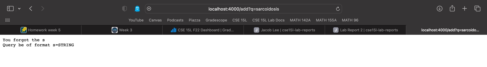
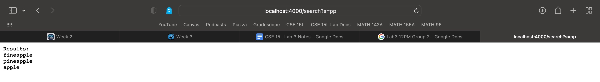

# Lab Report 2

## Part 1: Simplest Little Tinie Weenie Search Engine
I made a search engine that runs on my client machine! It's very *simple* but it gets the job done. Here is my code:
```
import java.io.IOException;
import java.net.URI;
import java.util.ArrayList;

class Handler implements URLHandler {
    ArrayList<String> strings = new ArrayList<String>();

    public String handleRequest(URI url) {
        System.out.printf("Path: %s Query: %s\n", url.getPath(), url.getQuery());
        if (url.getPath().equals("/")) {
            if (strings.size() == 0) {
                return String.format("There's nothing to search for!\nTry adding strings to the data bank so you can query them.\n");
            } else {
                return String.format("Your strings: %s", String.join("\n", strings));
            }
        } else if (url.getPath().contains("/add")) {
            String[] parameters = url.getQuery().split("=");
            if (parameters[0].equals("s")) {
                strings.add(parameters[1]);
                return String.format("%s added!", parameters[1]);
            } else {
                return "You forgot the s\nThe query should have the format ?s=STRING";
            }
        } else if (url.getPath().contains("/search")) {
            String[] parameters = url.getQuery().split("=");
            if (parameters[0].equals("s")) {
                String search = parameters[1];
                ArrayList<String> results = new ArrayList<String>();
                for (String str: strings) {
                    if (str.contains(search)) {
                        results.add(str);
                    }
                }
                return String.format("Results:\n%s", String.join("\n", results));
            } else {
                return "You forgot the s\nThe query should have the format ?s=STRING";
            }
        }
        return "404 Not Found!";
    }
}

class SearchEngine {
    public static void main(String[] args) throws IOException {
        if(args.length == 0) {
            System.out.println("Missing port number! Try any number between 1024 to 49151");
            return;
        }

        int port = Integer.parseInt(args[0]);

        Server.start(port, new Handler());
    }
}
```

Now let's take a look at the results.

1. First we add the string **fineapple**.
How do we add a string? What happens behind the scenes? The path and query used to add a string to our search engine are of the form `http://localhost:4000/add?s=STRING`. In this case **STRING** is replaced with **fineapple**. The function **handleRequest** of the class **Handler** is called, then enters an **if-else** tree. Since the path does not equal **/**, we move onto the next if statement. The path does contain **/add** so we enter this branch. A string array called **parameters** is created which contains the url query split on **=**. We now have two elements in the array. The first should be the string **s** and the second is the string we want to add. If the first element is not **s** we cannot add the second element to our database. Then we add **fineapple** to our list of strings. Note: My bestfriend's IG in middle school was andres_the_fineapple.


2. Next we add **sarcoidosis**. I learned this word from House, it's usually bad, it's a disease... and we get an error trying to add it. Why? Because our query is wrong! We used **?q=sarcoidosis** instead of **?s=sarcoidosis**. The **if-else** tree determined that **parameters[0]** was not equal to **s** so we entered the **else** branch. Then we received this message:

But not worry! Let's fix our mistake so we can successfully add "a rare condition that causes small patches of swollen tissue, called granulomas, to develop in the organs of the body." I mean **sarcoidosis**.


3. Lastly we search our database for any string containing a particular string. Most of the strings I added contain **app** so we're going to search for the string **pp**.
Searching for a string is similar to adding a string. We need the path and query used to search for a string to be of the form `http://localhost:4000/search?s=STRING`. In our case **STRING** will be replaced with **pp**. We once again enter our **if-else** tree via the **handleRequest** method in **Handler**. This time our path doesn't contain **/add** but instead contains **search/**. We once again create a string array called **parameters** containing the the query split on **=**. The array contains two elements, the string **s** and our search parameter. We create an arraylist called **results** to hold all strings we find containing the search parameter **pp**. We then print out the results to the webpage!


## Part 2: Bugs

It looks like we have a few problems in our code. Let's find the failure-inducing inputs, symptoms, and bugs! I will show two examples from two different files.

1. reverseInPlace (ArrayExamples)
* Original code:
```
static void reverseInPlace(int[] arr) {
    for(int i = 0; i < arr.length; i += 1) {
        arr[i] = arr[arr.length - i - 1];
    }
}
```

* Failure-inducing inputs:
- input1 is {1,2,3,4}
- input2 is {1,2,3,4,5}

* Symptoms:
- input1 outputs {1,2,2,1}
- input2 outputs {1,2,3,2,1}

* Bugs:
- No temporary variable is defined.
- Iterates throug whole array, so if a temporary variable were incorporated, it would reverse twice over, effectively not reversing at all.

* Fixed code:
```
static int[] reversed(int[] arr) {
    int[] newArray = new int[arr.length];
    for (int i = 0; i < arr.length; i += 1) {
        newArray[i] = arr[arr.length - i - 1];
    }
    return newArray;
}
```

* Explanation:
- There were two bugs, but one was the logical result of the other. The idea was to run through the entire array setting the element at index i to the element at the "opposite" index. Essentially flipping the array hence reversing it in place. The problem here is you overwrite the early values in the array so once the index is halfway through the for-loop you get both no changes to the array and loss of data.

2. filter (ListExamples)
* Original code:
```
interface StringChecker {
    boolean checkString(String s);
}

class ListExamples {
    static List<String> filter(List<String> list, StringChecker sc) {
        List<String> result = new ArrayList<>();
        for (String s : list) {
            if (sc.checkString(s)) {
                result.add(s);
            }
        }
    return result;
  }
}
```
```
public class ListTests {
    @Test
    public void testFilter() {
        List<String> input1 = Arrays.asList("1", "12", "123", "1234", "12345", "123456");
        assertEquals(Arrays.asList("1", "12", "123", "1234"), ListExamples.filter(input1, null));
    }
}
```

* Failure-inducing inputs:
- None?
- input1 = {"1", "12", "123", "1234", "12345", "123456"};

* Symptoms:
- We cannot run the test because no StringChecker object exists.
- If we use **null** as the StringChecker object then we receive:
```
1) testFilter(ListTests)
java.lang.NullPointerException: Cannot invoke "StringChecker.checkString(String)" because "<parameter2>" is null
        at ListExamples.filter(ListExamples.java:23)
        at ListTests.testFilter(ListTests.java:12)
```

* Bugs:
- The StringChecker interface is defined but no object inherits from it. Furthermore, the method proposed by the StringChecker interface is never defined.

* Fixed code:
```
interface StringChecker {
    boolean checkString(String s);
}

class ListExamples implements StringChecker {
    @Override
    public boolean checkString(String s) {
        return s.length() < 5;
    }

    static List<String> filter(List<String> list, StringChecker sc) {
        List<String> result = new ArrayList<>();
        for (String s : list) {
            if (sc.checkString(s)) {
                result.add(s);
            }
        }
        return result;
    }
}
```
```
public class ListTests {
    @Test
    public void testFilter() {
        List<String> input1 = Arrays.asList("1", "12", "123", "1234", "12345", "123456");
        assertEquals(Arrays.asList("1", "12", "123", "1234"), ListExamples.filter(input1, new ListExamples()));
    }
}
```

* Explanation:
- The easiest way to fix this bug is to allow ListExamples to inherit from StringChecker then define the checkString method in ListExamples. A larger problem here with no visible symptoms is allowing ListExamples to inherit from StringChecker. It serves no purpose. StringChecker should be it's own object.