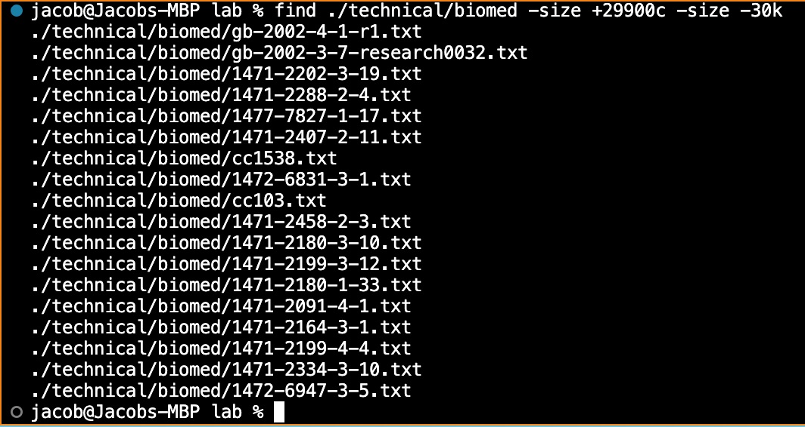

# Lab Report Week 5

The `find` command is commonly used to find files in bash. But that's boring, because we'd rather find files with **\*glamour\***. I'm talking about command options!

Here are 3 *glamorous* `find` options I found:

1. `find DIRECTORY -iname "PATTERN"`
    - This option is similar to `-name` except it's case insensitive. That means if your query **lOOks LikE tHiS** `find` will retrieve all paths in a given directory that match the case insensitive query. The number of `-iname` matches is greater than or equal to the number of `-name` matches.
    - 
    - 
    - 
2. `find DIRECTORY -amin -NUM_OF_MINUTES`
    - This option allows you to find all files in a given directory that have been accessed within the last **X** minutes. This may be especially helpful if your computer crashes while browsing a file in a large data set. **NUM_OF_MINUTES** can only take integer values.
    - 
    - 
    - 
3. `find DIRECTORY -size -MIN_SIZE -size -MAX_SIZE`
    - This option —wow the word **size** is repeated four times in that command— allows you to find files of size in a specified range in a given directory. **MIN_SIZE** and **MAX_SIZE** are inputs of the form **NUMBER LETTER** where the letter specifies 
        - b – 512-byte blocks (default)
        - c – bytes
        - w – two-byte words
        - k – Kilobytes
        - M – Megabytes
        - G – Gigabytes
        - J - Jacobytes (I made this one up)
    - 
    - 
    - 