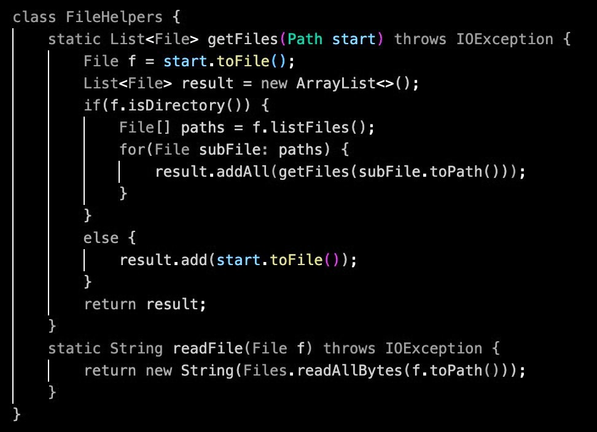

# Week 7 Lab Report

## Part 1

We want to edit the file `DocSearchServer.java` so the parameter `start` in the class `FileHelpers` is changed to `base` in as few keystrokes as possible using vim.

We want to turn this:

into this:

I (my group and I didn't get very far in lab) minimized the task to these 22 keystrokes:

`/start<enter>cebase<esc>n.n.:wq<enter>`

We can group these keystrokes into five main sections:

1. `vim DocSearchServer.java`

    First we open `DocSearchServer.java` with vim (which does not count toward the 22 keystrokes).

    

    

2. `/start<enter>`

    Now let's find the first instance of the parameter `start`.

    We'll do this using the search command `/` followed by our search parameter `start` then `<enter>`.

    

3. `cebase`

    Next we delete the first instance of the parameter `start` using the command `ce` which will take us into **insert mode**.

    

    Then we can replace it with the parameter `base`.
    
    

4. `<esc>n.n.`

    This is where the fun begins.
    
    We want to replace the remaining two instances of the parameter `start`. First we'll use the command `<esc>` to take us into **normal mode**.

    We don't need to repeat steps 1 or 2 to replace the other instances! Instead, we'll use the commands `n` and `.` to find and replace the other two instances of the parameter `start`.
    
    `n`

    

    `.`

    

    `n`

    

    `.`

    

5. `:wq<enter>`

    And boom! We're done. Finally we save the edits and exit Vim.

## Part 2

I completed the edit while logged into an ssh session using vim in 30 seconds.

I completed the edit from VSCode then secure copying to the remote server in 45 seconds.

In this case, vim enhanced my workflow by 30%, which on any project would be a game changer! The problem is not all projects may be as simple as editing a line in a file. For the majority of projects I would rather use VSCode because I'm comfortable and more efficient editing on an *advanced* text editor or an IDE than I am on a command line text editor like vim. Perhaps if I practice using vim then I'll develop my vim skills and one day prefer vim for editing on a remote server. But until that day, vim is not my first choice.

Vim.